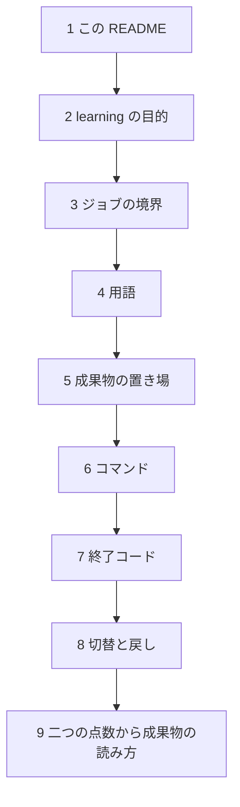

# Parts Search Quality Loop

多言語の部品検索で、失敗検知・GT更新・再学習・独立評価をつなぐPoC。
**T1〜T8を実装済み（2026-09-22）。Golden Path 9段階が実処理で通る。** 固定E5・ローカルQdrantによる検索、完全GT評価、構造化Feature、LightGBM LambdaRank、3 seed比較、疑似オンラインsimulation（版付きpolicy・paired stream・KPI）、独立holdout評価とonline guardrail、ReleaseBundleの原子的切替とrollbackがつながる。

## 初めて開いたときの読み順

ファイル名の番号順には読まない。`docs/01` は要件の契約で、最初の一枚ではない。仕様の地図は [文書索引](docs/00_index.md#first-read) に同じ順で置いてある。



| 順 | 文書 | ここで分かること |
|---|---|---|
| 1 | この README | 何の PoC か。終了コード。`make pipeline` |
| 2 | [learning](docs/learning/README.md) と [目的](docs/learning/01_purpose.md) | 評価を一つにしても完了ではない。VectorSearch、LightGBM、Feature Store のどれに対応するか |
| 3 | [02 アーキテクチャ](docs/02_architecture.md) | 検索・学習・評価が、どの成果物でジョブ分割されているか |
| 4 | [03 ドメイン](docs/03_domain_model.md) | CandidateSet、FeatureSchema、ReleaseBundle の境界 |
| 5 | [05 データ](docs/05_data_model.md) | `artifacts/` のディレクトリと、固定する checksum |
| 6 | [04 ワークフロー](docs/04_workflows.md) | 実行、prune、activate |
| 7 | [06 エラー](docs/06_error_policy.md) | 0 と 4 の違い。品質不採用は実行失敗ではない |
| 8 | [08 リリース](docs/08_release_runbook.md) | promote した bundle だけ active にする。smoke 失敗で戻す |
| 9 | [learning の 02 から 05](docs/learning/README.md) | オフラインと 1 位の KPI が食い違ったとき、どのジョブを回すか |

8 までで、パイプラインの切れ目と採用の関門が追える。9 が、このリポジトリで繰り返す中身である。

コードを変えるときは [01 要件](docs/01_requirements.md) と [07 テスト](docs/07_test_strategy.md)。今日の作業計画は [tasks](docs/tasks/README.md)。`docs/specs/` と `archive/` は初見では開かない。

## 現在地と実装順序

要件のGolden PathとAC-001〜011は T1〜T8 で実装済み。依存関係は[実装マスタータスク](docs/tasks/05_done/20260921-search-quality-poc-implementation.md)を参照する。

| # | 実装単位 | 状態 |
|---|---|---|
| Foundation | 設定、成果物store、bootstrap CLI、テスト、build | 実装済み |
| T1 | データ契約validatorと独立した手書きfixture | 実装済み（全14種の正常fixtureあり） |
| T2 | 合成Catalog、Query、GT、family分割 | 実装済み |
| T3 | Qdrant Vector BaselineとSearchRun | 実装済み |
| T4 | オフライン評価、Slice、FailureCase | 実装済み |
| T5 | 構造化FeatureとLightGBM LambdaRank | 実装済み |
| T6 | Experiment比較と品質Gate | 実装済み（系譜・終了コード分離まで） |
| T7 | 疑似オンラインFeedback Loop | 実装済み |
| T8 | 独立評価、Release、rollback、Golden Path E2E | 実装済み（promote→activate→rollbackを実測） |

商材別GTは05のT2契約、Embedding・FeatureSchema・品質閾値・SimulationPolicyの値はconfigと判断記録を参照する。設定が揃ったことを正式評価の合格とは扱わない。

**終了コード**: 0=完了 / 1=実行エラー / 2=設定未確定 / 3=骨組みのみ / **4=実行成功だが品質不採用**。
4は実行失敗ではない。小規模データでは`minSliceQueries`を満たさず4になる。**採用を得るために閾値を下げない。**

```bash
make pipeline                                   # 9段階を依存順に実行
make activate RELEASE=artifacts/releases/<id>   # promoteしたreleaseをactiveへ
make rollback                                   # 直前のactiveへ戻す
make prune                                      # 保持本数を超えた古いrunを削除する
```

## セットアップと起動

Python 3.11以上とuvを使用する。リポジトリ直下で実行する。

```bash
make setup
make config-check
make run
```

`make run`は設定snapshotと未設定レポートを `artifacts/runs/<run_id>/` へ保存する。外部サービスへの通信・検索・学習は行わない。

```bash
uv run --locked parts-search verify-artifact artifacts/runs/<run_id>
uv run --locked parts-search config-check --stage retrieval
make fmt lint test build
```

未設定の工程は`config-check`が不足項目を返して終了1となる。これは設定の充足判定であり、モデルやengineの存在・接続を検証するものではない。任意の設定を使う場合、`--project` / `--config`はサブコマンドの前に指定する。

現在利用できるCLIは次のとおり。

- `config-check`: 公開設定と工程別blockerを検査する。秘密値は読まない。
- `bootstrap`: foundation runを作る。`ml_executed=false`を記録する。
- `verify-artifact`: 完了runのinventoryとchecksumを検査する。
- `stages`: 全9段階と実装状況を一覧する。
- `stage catalog`: Catalog/Query/splitを生成する。
- `stage judgments --dataset <artifact>`: 明示したdatasetの完全判定GTを生成する。
- `pipeline`: 依存順に9段階を実行する。`golden_path_complete` のときだけ終了 0。
- `prune`: `artifacts.retention` を超えた古い run を削除する。active release と rollback 先、その入力は残す。

既定GTは2,000万行。実行手順と大規模読込APIは[ワークフロー](docs/04_workflows.md)を参照。

## 構成

```text
src/parts_search/
  cli.py                 argparseの入口
  config/                厳密なYAML・schema・パス・工程別検証
  artifacts/             JSON/JSONL・checksum・原子的run公開
  pipelines/bootstrap.py 設定から成果物までの最小実行経路
tests/                   単体・CLI結合テスト
env/                     非機密設定・パス・Git管理外の秘密情報
docs/tasks/              T1〜T8、未決事項、完了証跡
```

`env/project.yaml`のrepoRootはclone・移動後に実パスへ更新する。`config.yaml`のパスはrepoRoot基準。秘密ファイルは通常CLIで読み込まず、将来の接続adapterから明示的に使う。API keyを設定snapshotへ混ぜない。

依存は`pyproject.toml`と`uv.lock`で管理する。ML依存は各工程の実装時に追加する。既存runを消す汎用cleanコマンドは用意しない。

## スターターとの関係

`private-ops/tooling/starter-kit/assets/starters/python/ml` のsrc layout、argparse CLI、pipeline、manifestの分離を参考にした。住宅価格回帰やGCS/BigQuery連携は持ち込まず、設定検証と不変run保存を部品検索用に実装した。

設計の入口は [初めて開いたときの読み順](docs/00_index.md#first-read)。
