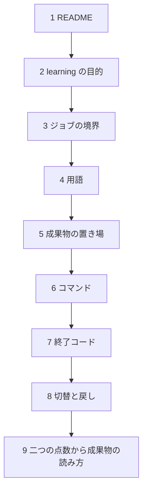

# プロジェクトドキュメント索引

このディレクトリは、プロジェクトの要件・設計・ワークフロー・テスト・リリース運用の正本。`AGENTS.md` は Codex / 他エージェント向けの repo ガイド、`CLAUDE.md` は Claude Code の司令塔、`docs/tasks/` は毎日の作業計画・実装タスク・調査ログの実行ハブ、`.claude/skills/` は Claude Code で繰り返し使う作業手順。

## 権威順位

```text
コード / Makefile / config / manifests
> docs
> docs/tasks
> README / CLAUDE / AGENTS
> archive
```

<a id="first-read"></a>

## 初めて開いたとき

ファイル名の `01` から順に読まない。`01_requirements.md` は範囲の契約で、最初の一枚はリポジトリ直下の README である。同じ表が README の先頭にもある。



| 順 | 文書 | ここで分かること |
|---|---|---|
| 1 | [README](../README.md) | 何の PoC か。終了コード。`make pipeline` |
| 2 | [learning/README.md](./learning/README.md) と [目的](./learning/01_purpose.md) | 評価を一つにしても完了ではない。VectorSearch、LightGBM、Feature Store のどれに対応するか |
| 3 | [02_architecture.md](./02_architecture.md) | 検索・学習・評価が、どの成果物でジョブ分割されているか |
| 4 | [03_domain_model.md](./03_domain_model.md) | CandidateSet、FeatureSchema、ReleaseBundle の境界 |
| 5 | [05_data_model.md](./05_data_model.md) | `artifacts/` のディレクトリと、固定する checksum |
| 6 | [04_workflows.md](./04_workflows.md) | 実行、prune、activate |
| 7 | [06_error_policy.md](./06_error_policy.md) | 0 と 4 の違い。品質不採用は実行失敗ではない |
| 8 | [08_release_runbook.md](./08_release_runbook.md) | promote した bundle だけ active にする。smoke 失敗で戻す |
| 9 | [learning の 02 から 05](./learning/README.md) | オフラインと 1 位の KPI が食い違ったとき、どのジョブを回すか |

8 までで、パイプラインの切れ目と採用の関門が追える。9 が、このリポジトリで繰り返す中身である。

| 開くタイミング | 文書 |
|---|---|
| 範囲を変えるとき | [01_requirements.md](./01_requirements.md) |
| コードを変えるとき | [07_test_strategy.md](./07_test_strategy.md) |
| 今日の作業 | [tasks/README.md](./tasks/README.md) |
| 目的が 01〜08 と食い違ったとき | [元設計メモ](./archive/search-quality-loop-brainstorm.md) |

`docs/specs/`、`templates/`、`memory/` はエージェント制御である。初見のプロダクト読み順には入らない。

## 作業に入ったあと

| 入口 | 用途 |
|---|---|
| [tasks/README.md](./tasks/README.md) | 今日やること、次にやること、完了したことを管理する |
| [tasks/03_active/refactoring-candidates.md](./tasks/03_active/refactoring-candidates.md) | 常時見る cleanup / refactoring 候補 |
| [learning/README.md](./learning/README.md) | オンライン精度をこの土台で学ぶ読み順。契約ではない |
| [04_workflows.md](./04_workflows.md) | 作業開始、検証、リリース前確認のコマンド |
| [07_test_strategy.md](./07_test_strategy.md) | タスク完了前に通す品質ゲート |

`docs/tasks/` は仕様の正本ではないが、日々の実行順・証跡・未決事項の正本として扱う。確定した仕様は `docs/specs/` や 01〜08 文書へ、判断理由は `docs/adr/` へ昇格する。

## ドキュメント一覧

| ドキュメント | 役割 |
|---|---|
| [01_requirements.md](./01_requirements.md) | 目的・範囲・ユーザー・ユースケース・Critical User Journey / Golden Path |
| [02_architecture.md](./02_architecture.md) | 構成要素・境界・実行モデル |
| [03_domain_model.md](./03_domain_model.md) | 用語・状態・ビジネス概念 |
| [04_workflows.md](./04_workflows.md) | ローカルコマンドと運用フロー |
| [05_data_model.md](./05_data_model.md) | データ・スキーマ・設定・永続化 |
| [06_error_policy.md](./06_error_policy.md) | エラー処理・リトライ・ログ |
| [07_test_strategy.md](./07_test_strategy.md) | テスト方針と品質ゲート |
| [08_release_runbook.md](./08_release_runbook.md) | リリース・マイグレーション・復旧 |
| [learning/README.md](./learning/README.md) | MLOps 向けの学習ガイド。オフラインとオンラインが食い違ったときの読み順。挙動の正本ではない |
| [tasks/README.md](./tasks/README.md) | 日次運用の実行ハブ、作業計画、実装タスク |

## PoC設計の素材

- [元設計メモ](./archive/search-quality-loop-brainstorm.md): 整理前の検討素材（現行契約は01〜08）。
- [参照実装レビュー](./reference-implementation-review.md): 固定commitで確認した事実と設計への採否。
- `archive/`: 元メモ・添付全文を保存する参考素材。権威順位は最下位。

## ハーネス（AI 制御）

AI エージェント制御の全体像は `.claude/README.md`。アーキ本体とその repo 固有 instantiation は `docs/specs/` に置く。

| ドキュメント | 役割 |
|---|---|
| [specs/kurosawa-thin-harness-architecture.md](./specs/kurosawa-thin-harness-architecture.md) | Thin Harness アーキ本体（tool-agnostic マスター） |
| [specs/runtime-protocol.md](./specs/runtime-protocol.md) | 実行手順と停止条件（repo 固有） |
| [specs/capability-boundary.md](./specs/capability-boundary.md) | 保護 capability と permissions 写像（脅威モデル） |
| [specs/change-boundary.md](./specs/change-boundary.md) | 保護パスと変更境界 |
| [specs/evidence-policy.md](./specs/evidence-policy.md) | Evidence Level と done の下限 |
| [specs/judgment-memory.md](./specs/judgment-memory.md) | 判断記憶のパイプライン |
| [templates/](./templates/) | 各 Layer のテンプレ（contract / weight-class / reality-check 等） |
| [decisions/decision-log.md](./decisions/decision-log.md) | 判断日誌（trade journal、append-only） |
| [memory/](./memory/) | 蒸留済み判断記憶 |
