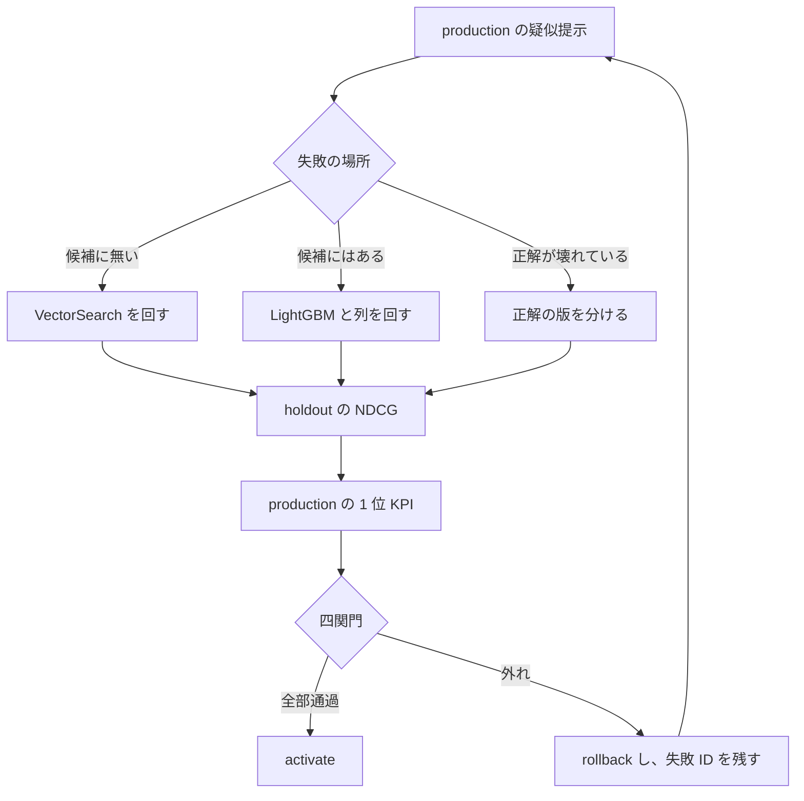

# 目的

## 一文

このリポジトリは、評価スクリプトを一つにまとめること自体がゴールではない。
まとめた評価で **オフラインの改善をオンラインの改善と誤認せず、原因の段だけを回し直し、学習に使っていない集合でオンライン側が動いたか** を確認する手順を、架空データで繰り返すためのものである。

元メモの結論は次のとおり。出典は [0 章](../archive/search-quality-loop-brainstorm.md)。

> オフラインで NDCG が上がっても、オンラインの成功率や CTR が動かなければ意味がない。
> 必要なのは NDCG を上げられる人ではなく、オンライン精度が悪い原因を切り分け、改善ループを回せる人。

プラットフォームの仕事に引きつけると、こうなる。DS が VectorSearch と LightGBM の改善を持ってくる。評価がスクリプトごとに散らばっていると、NDCG のスクリプトだけが緑でリリースされる。統合した評価基盤の完了条件は、そのリリースを一つの `decision` で止められることである。止めたあとに、どのジョブを回し直すとオンラインが動くかを辿れることが、このリポジトリで学ぶ中身である。

## すでに知っていることで足りる範囲

訓練と評価の分離、リーク、検証スコアを見てから提出閾値を動かす危険は、コンペの経験で足りる。
パイプラインを stage に切り、成果物を不変にして、失敗したジョブだけ再実行するのも本職の範囲である。

検索で追加になるのは次の三点だけである。

1. 入力表が最初から与えられない。VectorSearch の出力が LightGBM の入力表である。表に無い正解は、リランキングでは 1 位にできない。
2. オフラインの主指標（NDCG@10）と、オンラインで見ているもの（1 位の適合、1 位の必須条件違反）は、同じ並びの別の質問である。コンペの public と private のように、同じ指標の行を入れ替えたずれではない。
3. オンラインのクリックで正解ラベルを更新すると、今見たトラフィックにだけ強いモデルになる。Feature Store に列を足す前に、その列の教師がどの集合のものかを固定する。

## 検証したい問い

オフラインとオンラインが食い違ったとき、**VectorSearch のジョブと LightGBM のジョブのどちらを、どの入力を固定して回し直すと、オンラインが動くか**。

オフライン指標は、その動きの予測として置いてある。予測が外れた実行を不採用にし、失敗 ID を次のジョブの入力に残せるかが、土台の使い道である。

## ループ

疑似オンラインは実トラフィックではない。ここで確認できるのは、凍結した行動規則のうえで KPI が動いたかまでである。参画先の A/B の代わりにはしない。A/B の前に、オフライン改善を無条件で流さないための関門として読む。

## 完了と読まないもの

- 評価ジョブが一つのパイプラインに繋がったこと
- NDCG が上がったこと
- Feature Store の列定義が埋まったこと
- seed を変えて点数が同じだったこと。このトレーナーは seed を subsample に使っていない

完了に近い観測は、原因を一段に決めた再実行のあと、Holdout の並びと production の 1 位 KPI が、学習に使った集合と同じ方向に動いたことである。
