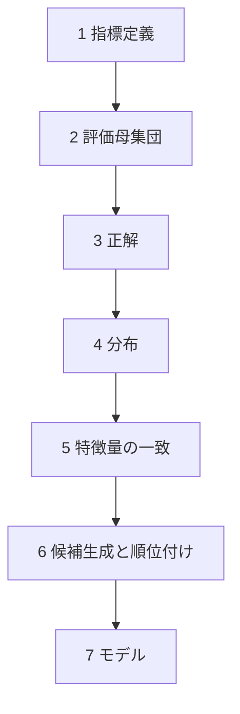
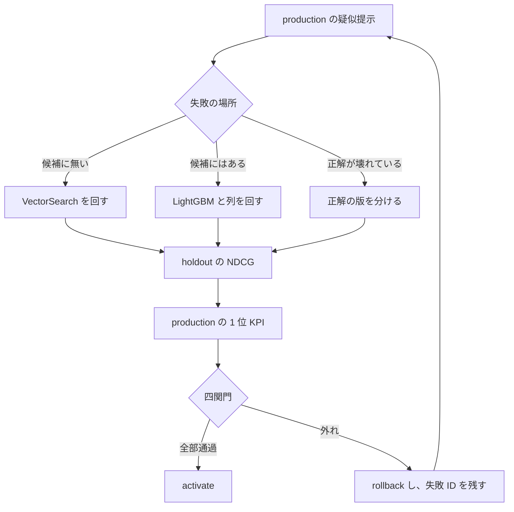

# 目的

## 成功

成功は、この PoC を本番の検索として運用することではない。架空データの上に、次の問題へのロードマップが残っていることである。

DS チームから「オフラインの精度はそこそこあるが、オンラインで精度が下がる」と渡されたとき、データサイエンスの最低限（モデル、前処理、訓練、評価、オフラインとオンライン、パイプライン）と MLOps の知識だけで、対応の順を説明できる。その順は、DS がすでに使っている切り方に寄せる。候補を出す VectorSearch（と、参画先では Elasticsearch）、その表の上の LightGBM、列の版、評価を一つの関門にまとめること。新しいモデルの作り方をここで発明しない。

ロードマップの中身は、オフラインの改善をオンラインの改善と誤認せず、原因の段だけを回し直し、学習に使っていない集合でオンライン側が動いたかを確認する手順である。必要なのは DS の代替ではなく、DS に返す前の診断である。指標、ラベル、分布、特徴量、リーク、オフラインとオンラインのずれ、実験の切り方までを見る。モデルの数式、新しいアルゴリズム、高度な統計推定は、このロードマップの範囲に入らない。

## 対応の順

モデルを疑うのは最後である。DS が「オフラインは悪くないがオンラインで落ちる」と言ったとき、次の順で成果物を開く。

| 順 | 確認すること | このリポジトリで開くもの |
|---|---|---|
| 1 | NDCG や MRR と、検索成功率・誤適合が、同じ成功を見ているか | MetricPolicy と SimulationPolicy。CTR と再検索は記録し、関門には使わない |
| 2 | 言語、クエリ種別、カテゴリで落ち方が違うか | `slices.jsonl`。種別は型番、自然文、寸法依存 |
| 3 | 正解の作り方と、クリックを正解に上げていないか | judgments。`promoted_to_evaluation_gt` は false |
| 4 | 学習、holdout、production が同じ family を共有していないか | splits。一つの family は一つの分割だけ |
| 5 | 学習時と推論時の列が同じか | `feature_schema.json` の checksum。release はモデルを読み直して列順と gain の一致を見る |
| 6 | 候補 100 件に正解が無いか、候補の中の 1 位が悪いか | Recall@100 と、`retrieval_miss` / `rerank_miss` |
| 7 | LightGBM の重み、埋め込み、損失 | 1 から 6 のあと。列を足すのも、この順で 5 と 6 が残ったときだけ |

いま残っている通し実行は、オフラインとオンラインが同じ方向に動いた例である。この順の教材として強いのは、オフラインは通ってオンラインの関門だけが外れる実行を、意図して残すことである。その記録は [証跡](./04_evidence.md) にあるとおり、まだ無い。

元メモの結論は次のとおり。出典は [0 章](../archive/search-quality-loop-brainstorm.md)。

> オフラインで NDCG が上がっても、オンラインの成功率や CTR が動かなければ意味がない。
> 必要なのは NDCG を上げられる人ではなく、オンライン精度が悪い原因を切り分け、改善ループを回せる人。

プラットフォームの仕事に引きつけると、こうなる。DS が VectorSearch と LightGBM の改善を持ってくる。評価がスクリプトごとに散らばっていると、NDCG のスクリプトだけが緑でリリースされる。統合した評価基盤の完了条件は、そのリリースを一つの `decision` で止められることである。止めたあとに、どのジョブを回し直すとオンラインが動くかを辿れることが、このリポジトリで学ぶ中身である。

## すでに知っていることで足りる範囲

訓練と評価の分離、リーク、検証スコアを見てから提出閾値を動かす危険は、コンペの経験で足りる。
パイプラインを stage に切り、成果物を不変にして、失敗したジョブだけ再実行するのも本職の範囲である。

検索で追加になるのは次の三点だけである。

1. 入力表が最初から与えられない。VectorSearch の出力が LightGBM の入力表である。表に無い正解は、リランキングでは 1 位にできない。
2. オフラインの主指標（NDCG@10）と、オンラインで見ているもの（1 位の適合、1 位の必須条件違反）は、同じ並びの別の質問である。コンペの public と private のように、同じ指標の行を入れ替えたずれではない。
3. オンラインのクリックで正解ラベルを更新すると、今見たトラフィックにだけ強いモデルになる。Feature Store に列を足す前に、その列の教師がどの集合のものかを固定する。

## 検証したい問い

オフラインとオンラインが食い違ったとき、**VectorSearch のジョブと LightGBM のジョブのどちらを、どの入力を固定して回し直すと、オンラインが動くか**。

オフライン指標は、その動きの予測として置いてある。予測が外れた実行を不採用にし、失敗 ID を次のジョブの入力に残せるかが、土台の使い道である。

## ループ

疑似オンラインは実トラフィックではない。ここで確認できるのは、凍結した行動規則のうえで KPI が動いたかまでである。参画先の A/B の代わりにはしない。A/B の前に、オフライン改善を無条件で流さないための関門として読む。

## 完了と読まないもの

- この PoC を本番の検索として運用したこと
- 評価ジョブが一つのパイプラインに繋がったこと
- NDCG が上がったこと
- Feature Store の列定義が埋まったこと
- seed を変えて点数が同じだったこと。このトレーナーは seed を subsample に使っていない

完了に近い観測は、原因を一段に決めた再実行のあと、Holdout の並びと production の 1 位 KPI が、学習に使った集合と同じ方向に動いたことである。
