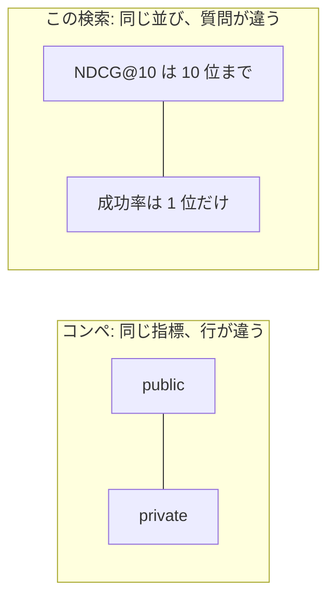
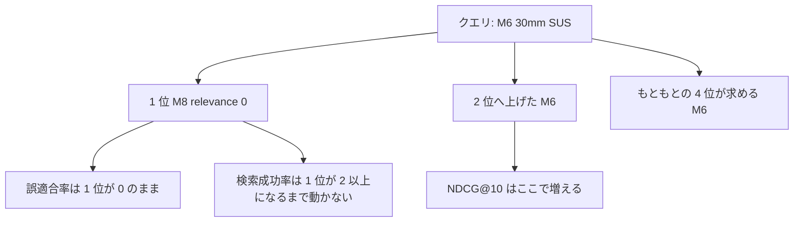
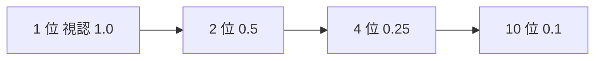
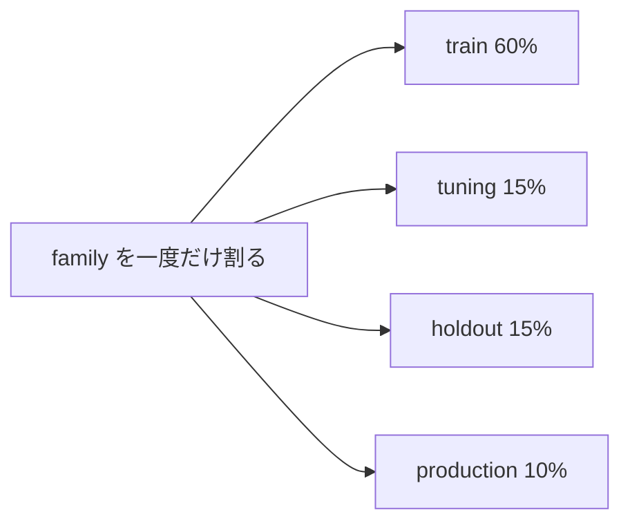

# 二つの点数

コンペでいうオフラインは、だいたい「公開スコアに触れる前の検証」である。public と private は同じ指標で、行が入れ替わる。大きく揺れるのは分布のずれか、検証の切り方の漏れである。

検索のオフラインとオンラインは、その種類のずれではない。**同じ並びについて、集計の質問が違う。** 質問が違うので、検証が正しくても両方は一緒に動かない。

## オフライン

質問は「適合する商品は、リストのどの位置にいるか」である。

正解はクエリ × 商品の relevance 0〜4 である。4 は型番一致、3 はカテゴリと寸法の一致、2 はカテゴリに加えて用途と材質、1 は意味が近いだけ、0 は別カテゴリか必須条件違反である。コンペの 0/1 ラベルより段がある。NDCG はその段をゲイン `{0:0, 1:0, 2:1, 3:3, 4:7}` に写してから、上位 10 件の並びを見る。relevance 1 は「近い」がゲイン 0 なので、意味が近いだけの 1 位は NDCG にもオンラインの成功にも点数を出さない。

| 指標 | どの段のジョブを見るか |
|---|---|
| Recall@100 | VectorSearch。候補 100 件に適合が入ったか。順位は見ない |
| MRR@100 | 最初の適合が何位か。リランキングの 1 件目に近いが、10 位以内の最初の適合でも点が出る |
| NDCG@10 | リランキングの並び。2 位や 8 位を直しても上がる |

主指標は NDCG@10 である。Recall と MRR は、それを上げる変更が候補生成を壊していないかのガードレールである。集計はクエリマクロで、失敗クエリは null のまま残す。行が欠けた平均を、コンペの提出ファイルが埋まったスコアのように扱わない。

## オンライン

質問は「最初に見せた 1 件で、探すのをやめられるか」である。

疑似ユーザーの視認確率は `1 / 順位` である。1 位は 1、10 位は 0.1。クリックと購入と再検索は、その視認と relevance から作った固定規則である。実ログの推定ではない。版は `parts_sim_v1.0.0` で、採否の途中で確率を動かさない。

採否に入れるのは二つである。

| 指標 | 質問 |
|---|---|
| `searchSuccessRate` | 観測が閉じた提示のうち、最上位の relevance が 2 以上か |
| `wrongFitmentRate` | 空でない提示のうち、最上位の relevance が 0 か。寸法違いの 1 位はここに入る |

CTR、再検索率、0 件率、購入率は同じ run に残すが、関門の合否には使っていない。NDCG が上がって CTR も上がった、という報告だけでは関門を通ったことにならない。

## 食い違いが起きるメカニズム

NDCG@10 は、適合が 20 位から 4 位へ上がっただけで増える。検索成功率は、その商品が 1 位になるまで動かない。誤適合率は、1 位が relevance 0 のままなら下がらない。

部品のベクトルは「M6 SUS」と「M8 SUS」を近くに置く。1 位が M8（relevance 0）、4 位が求める M6 のとき、リランキングが M6 を 2 位まで上げると NDCG は上がる。1 位が M8 のままなら誤適合率は残る。これが、オフライン改善を VectorSearch も LightGBM も触らずに採用してよい、と言えない理由である。

視認は `1 / 順位` なので、点数の重みも 1 位に寄る。

候補 100 件に適合が無いときは、LightGBM の入力表に正例が無い。どれだけ学習しても 1 位は正解にならない。Recall@100 と検索成功率が一緒に悪く、直すジョブはリランキングではない。

## 分割は行ではなく family

日英は同じ意図の言い換えなので、行で割ると学習と評価に同じ意図が入る。コンペでユーザー単位に割るのと同じで、ここでは family 単位である。

一つの family は四つのうち一つにしか入らない。

| 分割 | 比率の初期値 | 使ってよいこと |
|---|---|---|
| train | 0.60 | LambdaRank のフィット |
| tuning | 0.15 | 設定の選択。フィットには使わない |
| holdout | 0.15 | オフラインの独立比較。見ながら閾値を動かさない |
| production | 0.10 | 疑似オンライン。不採用の原因を見るまでは改善材料にしない |

不採用のクエリを見て production の正解を書き換え、同じ production で再測定して通すのは、private を見てから再提出するのに近い。このリポジトリはクリックを評価用正解へ昇格させない。`promoted_to_evaluation_gt` は false のままである。
