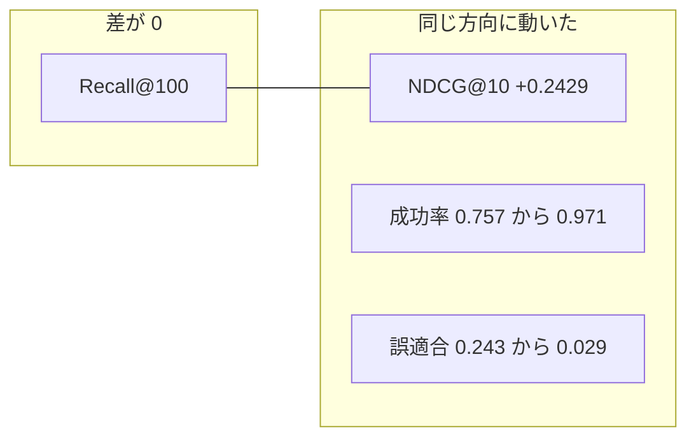
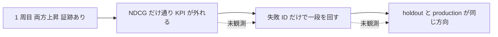

# いま証跡が答えていること

数字の出典は [Golden Path 通し検証](../tasks/05_done/2026-09-22-GoldenPath通し検証とAC証跡.md) だけである。この文書は読み方を書く。測定値は足さない。

## 何が動いたか

1,500 SKU、700 family、1,400 クエリ。変更は、ベクトル候補の上に `parts_features_v1` と LambdaRank を足したことである。VectorSearch に相当する取得そのものは baseline と共通である。

| 観測 | 値 | ジョブへの読み |
|---|---|---|
| Recall@100 の差 | 0 | 候補集合は変わっていない。VectorSearch ジョブの改善ではない |
| NDCG@10 | baseline 0.7479、差 +0.2429（seed 11, 22, 33 で同じ） | リランキングが上位 10 件の並びを動かした |
| 検索成功率 | 0.757 → 0.971 | 1 位の relevance が 2 以上になる提示が増えた |
| 誤適合率 | 0.243 → 0.029 | 1 位が relevance 0 の提示が減った |
| 再検索率 | 0.227 → 0.171 | 関門には使っていない。同じ方向の参考 |
| 失敗件数 | retrieval_miss 488、rerank_miss 336、simulation_miss 4 | 取りこぼしは残った。1 位の失敗はほぼ消えた |

Recall が止まっているので、動いた信用は LightGBM 側に限る。488 件の取りこぼしは、この promote の外に残っている。

10,000 SKU、正解 2,000 万行の別実行も同じ方向である。holdout の NDCG@10 は +0.2589、検索成功率の差は +0.21、誤適合率の差は -0.21。exit 0、`promote`。

これは、コンペでいうと public も private も同じ方向に動いた提出である。教材の失敗（寸法が近い別部品が 1 位）に対して、構造化の列が 1 位を動かした、と読める。Recall が動いていないので、その信用は LightGBM 側に限定できる。

## 読み違えると学習にならない箇所

seed 三つで NDCG は小数 9 桁まで同じで、モデル checksum は seed ごとに違う。`repetition_signal` は `no_metric_variance_across_seeds` である。分散が小さいのではない。評価基盤の「複数 seed」欄を、このトレーナーのまま頑健性の証跡にしない。

`retrieval_miss` が 488 残って `promote` されている。リランキングの採用は、候補生成の未改善を消していない。統合評価が一つの緑でも、残件の段は別ジョブのまま残る。

`simulation_miss` は 4 件まで減っている。関門は通っている。この件数が多いまま NDCG だけ大きい run は、この証跡の中には無い。

## まだ無い実験

学ぶ対象は、オフラインとオンラインが割れたあとの 2 周目である。次は残っていない。

- NDCG は accepted で、検索成功率か誤適合率が関門を外して `promote` にならなかった run
- その `failures.jsonl` の ID だけを渡し、候補 run を固定したまま列を変えた次実験。または候補生成だけを変えた次実験
- 2 周目で、holdout と production が学習集合と同じ方向に動いた記録
- NDCG の差がオンライン KPI の差を外した回数。予測として使えるかは、両方が上がった一例では決められない

関門が割れを不採用にするところまでは実装されている。不採用のあとオンラインを動かした記録が、この土台で次に残す学習の成果物である。
