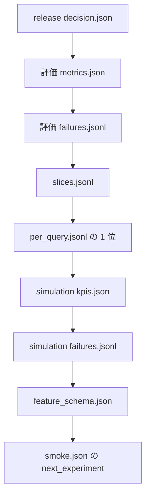

# 成果物の読み方

コマンドの契約は [04 ワークフロー](../04_workflows.md)。ここは、NDCG 改善を採用してよいかを判断するときに開く順である。

小規模実行は `minSliceQueries` を満たさず exit 4 になる。ジョブ失敗の exit 1 とは別である。4 のときに関門の数値を下げて exit 0 にすると、学習用の不採用が消える。

```bash
uv run --locked parts-search pipeline
uv run --locked parts-search activate artifacts/releases/<run_id>
uv run --locked parts-search rollback
```

## 採用判断で開く順

run の種類は `manifest.json` の `metadata.stage` で区別する。評価と simulation はどちらも `artifacts/runs/` に入る。



Recall の差が 0 なら、`metrics.json` の次は VectorSearch の再実行ではなく、失敗種別と `feature_schema.json` へ進む。`retrieval_miss` が残件の本体なら、列の checksum の前に候補 run が固定できているかを見る。

| 順 | 場所 | 見るフィールド | 判断 |
|---|---|---|---|
| 1 | release `decision.json` | `decision` と `gate_results` | 止まった関門がオフラインか、holdout か、二つの KPI か |
| 2 | 評価 `metrics.json` | NDCG@10、Recall@100、MRR@100 の差 | Recall 差が 0 なら VectorSearch ジョブは触っていない |
| 3 | 評価 `failures.jsonl` | `category` の件数と `query_id` | 残件が `retrieval_miss` なら次は候補生成。`rerank_miss` なら列 |
| 4 | `slices.jsonl` | language、query_type、category の件数と指標 | マクロの裏に、寸法クエリだけ落ちていないか |
| 5 | `per_query.jsonl` | 1 位と relevance | NDCG が良いクエリの 1 位が、relevance 0 のままではないか |
| 6 | simulation `kpis.json` | `searchSuccessRate`、`wrongFitmentRate`、分母 | 分母 0 は null。null を 0 や合格にしない |
| 7 | simulation `failures.jsonl` | `simulation_miss` の `query_id` | 評価側の `rerank_miss` と同じクエリか。違うなら 1 位の定義がずれている |
| 8 | モデル `feature_schema.json` | 列順と checksum | 学習ジョブとバッチ推論の Feature Store 版が同じか |
| 9 | `smoke.json` の `next_experiment` | 親実験、失敗 ID、release ID | 次のジョブが、今回の不採用を入力にできるか |

候補を固定した比較かは、評価 manifest の `metadata.search` が baseline と candidate でどう違うかで見る。リランキング実験で search の path が両側で違っていたら、VectorSearch の再実行が混ざっている。

## ディレクトリ

| stage | パス | 判断に使うもの |
|---|---|---|
| evaluation | `artifacts/runs/` | `metrics.json` `per_query.jsonl` `slices.jsonl` `failures.jsonl` |
| training | `artifacts/models/` | `feature_schema.json` `bundle.json`（`fit_split` が train か） |
| gate | `artifacts/experiments/` | オフライン比較まで。ここの `decision` では切り替えない |
| simulation | `artifacts/runs/` | `kpis.json` `failures.jsonl` `impressions.jsonl` |
| release | `artifacts/releases/` | `decision.json` `smoke.json`。`bundle.json` は promote のときだけ |

## 評価基盤に寄せたときに落とす解釈

- クリック集計を、評価用正解の更新として採用しない。昇格フラグは false のままである
- `active.json` はローカルの参照切替である。実トラフィックの配信証明ではない
- `repetition_signal` を見ずに、seed 数だけを頑健性のチェック項目にしない
- `prune` は active と rollback 先、その入力 run を残す。失敗 ID を次の実験に渡す前に、その run を保持本数の外に置かない

契約へ戻る場所は次のとおり。

| 詰まり | 正本 |
|---|---|
| ゲイン、relevance、分母、null | [05](../05_data_model.md) |
| 関門の定義 | [07](../07_test_strategy.md) と `qualityGate` |
| 切替と戻し | [08](../08_release_runbook.md) |
| なぜ NDCG だけでは終えないか | [元メモ](../archive/search-quality-loop-brainstorm.md) の 0 章と 9 章 |
